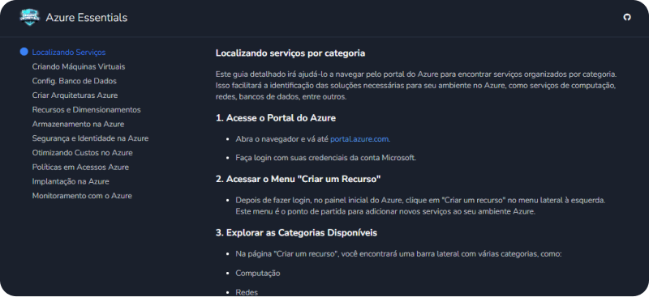

# Microsoft Azure Essentials DIO 🌐

**🔗 Link**: https://kellinton.github.io/microsoft-azure-essentials/

# Bootcamp Microsoft Azure Essentials

Este repositório centraliza todos os desafios práticos relacionados ao bootcamp, oferecendo acesso fácil e organizado para seu estudo e prática.

## Desafios do Bootcamp

1. **[Localizando Serviços por Categoria](link-para-desafio-localizando-serviços)**
   - **Descrição**: Aprenda a localizar serviços no portal do Azure organizados por categoria e utilize as ferramentas de pesquisa e filtros disponíveis.

2. **[Criando Máquinas Virtuais na Azure](link-para-desafio-criando-máquinas-virtuais)**
   - **Descrição**: Siga os passos para criar e configurar máquinas virtuais no Azure, entendendo as opções e configurações disponíveis.

3. **[Configurando uma Instância de Banco de Dados na Azure](link-para-desafio-configurando-banco-de-dados)**
   - **Descrição**: Configure uma instância de banco de dados no Azure, explorando diferentes opções de banco de dados e suas configurações.

4. **[Construindo Arquiteturas no Azure](link-para-desafio-construindo-arquiteturas)**
   - **Descrição**: Crie e implemente arquiteturas de solução no Azure, combinando diferentes serviços para atender a requisitos específicos.

5. **[Configurando Recursos e Dimensionamentos em Máquinas Virtuais na Azure](link-para-desafio-configurando-recursos)**
   - **Descrição**: Configure e ajuste os recursos e dimensionamentos das máquinas virtuais para otimizar desempenho e custo.

6. **[Dominando o Armazenamento na Azure](link-para-desafio-dominando-armazenamento)**
   - **Descrição**: Explore e configure diferentes opções de armazenamento no Azure, aprendendo sobre tipos e gerenciamento de dados.

7. **[Entendendo sobre Segurança e Identidade na Azure](link-para-desafio-seguranca-identidade)**
   - **Descrição**: Configure e gerencie segurança e identidade no Azure, incluindo políticas de acesso e proteção de dados.

8. **[Otimizando Custos no Azure](link-para-desafio-otimizando-custos)**
   - **Descrição**: Aprenda a monitorar e otimizar os custos associados ao uso de serviços Azure.

9. **[Gerenciando Políticas em Acessos Azure](link-para-desafio-gerenciando-politicas)**
   - **Descrição**: Configure e gerencie políticas de acesso e permissões no Azure para garantir controle e segurança.

10. **[Ferramentas de Implantação na Azure](link-para-desafio-ferramentas-implantacao)**
    - **Descrição**: Utilize ferramentas de implantação no Azure para automatizar e gerenciar a implementação de recursos.

11. **[Monitoramento Inteligente com o Azure](link-para-desafio-monitoramento-inteligente)**
    - **Descrição**: Configure e use ferramentas de monitoramento inteligente para rastrear e analisar o desempenho e a integridade dos recursos Azure.

## 🔗 Recursos Adicionais

- **[Documentação Oficial do Azure](https://docs.microsoft.com/azure)**: Fonte primária de documentação sobre serviços e recursos Azure.
- **[Curso Microsoft Azure Essentials](https://web.dio.me/track/microsoft-azure-essentials)**: Curso complementar para aprofundar seus conhecimentos sobre o Azure.
- **[Guia de Estudos para AZ-900](https://learn.microsoft.com/pt-br/credentials/certifications/resources/study-guides/az-900)**: Guia detalhado para ajudá-lo a se preparar para o exame AZ-900.

